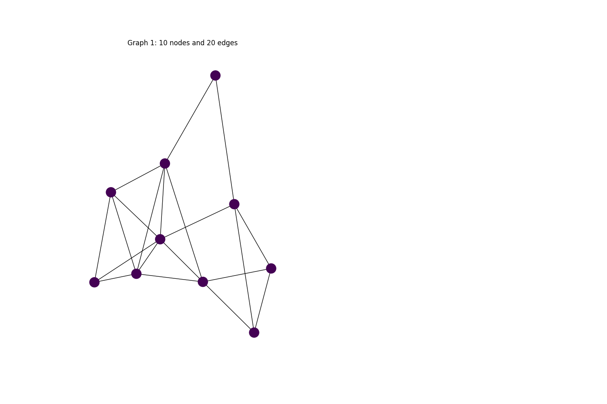
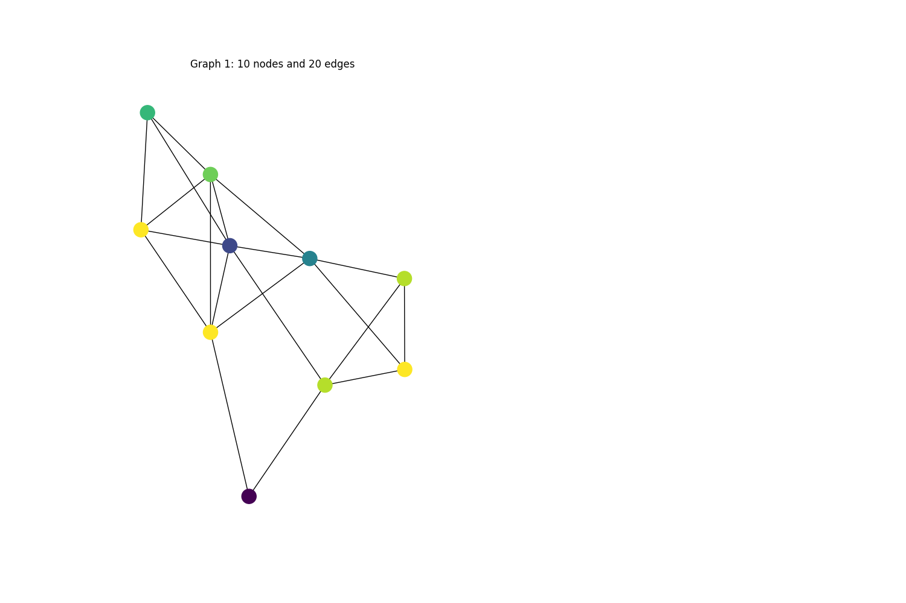
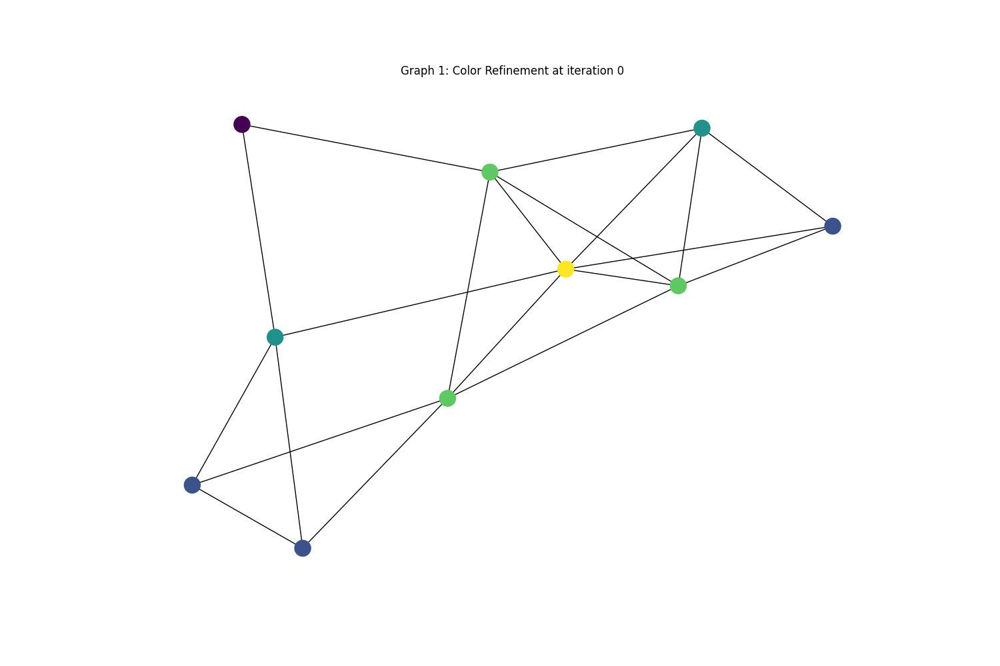

# Graph Isomorphism Test

Created: May 20, 2022 4:17 PM
Status: In Progress
tags: graph-theory

# Learning Objectives

- get insights about graph isomorphism (graph similarity)

# The Project

## Materials

- Jure Leskevoc: Lecture 2: Graph-Level Features and Graph Kernels

[https://www.youtube.com/watch?v=buzsHTa4Hgs&t=1082s](https://www.youtube.com/watch?v=buzsHTa4Hgs&t=1082s)

- Graph Isomorphism

[Graph isomorphism - Wikipedia](https://en.wikipedia.org/wiki/Graph_isomorphism)

## Approach 📝

First assign each node label 1, then for each node $v$ at step $i$ we assign it a new color based on the multiset of neighbors colors as stated in equation 1. we keep repeating this process $k$ times. at last each node in the graph has encoded its own structural informations.

**we run this algorithm for any two given graphs (with same number of nodes and edges), at final step we compare the coloring for these graphs if they are similar then the two graphs are isomorphic** 

### Figures

## Color Refinement in action

### Equations

$$
C_{i,v} = Hash(C_{i-1, v}, \{C_{i-1, u}; u \in \mathcal{N}(v)\})
$$